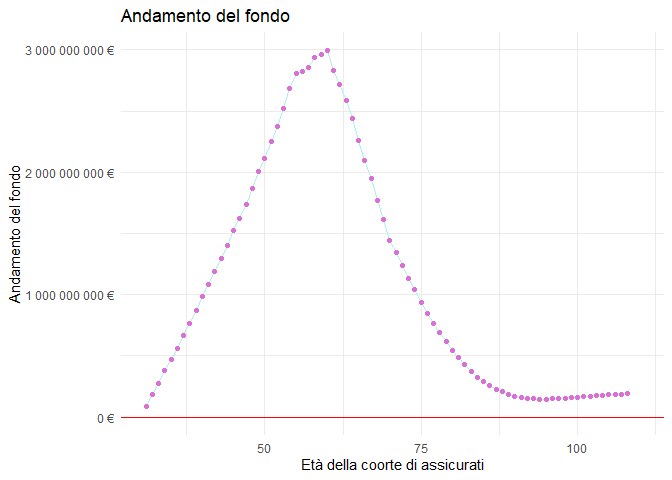
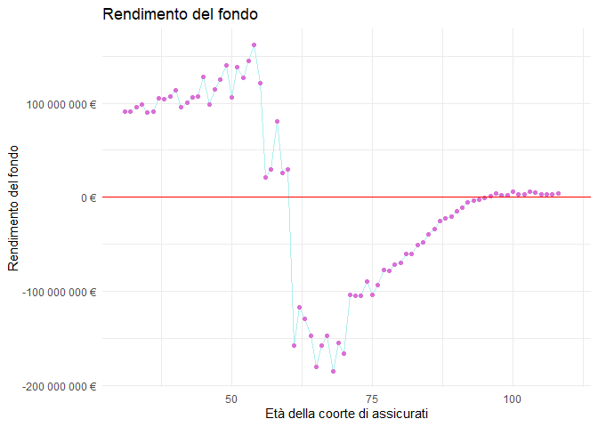
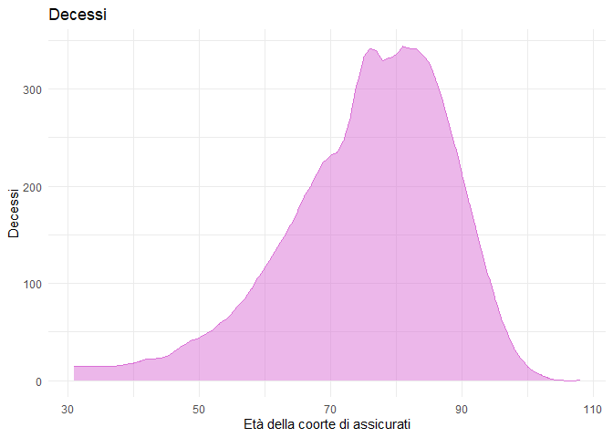
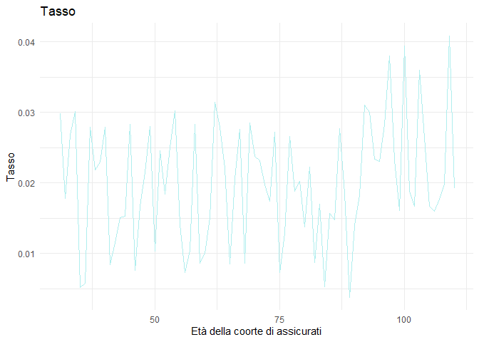
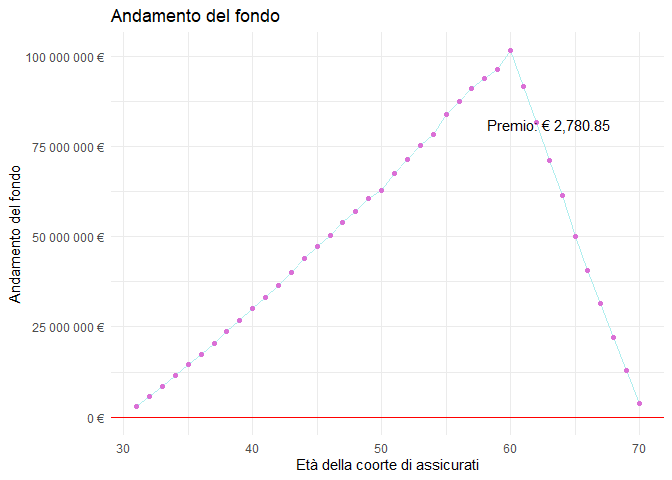
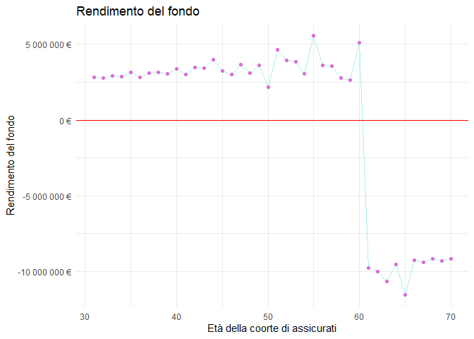
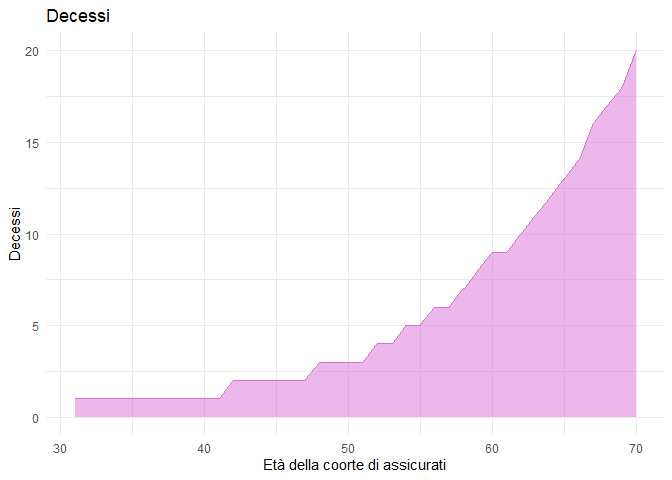
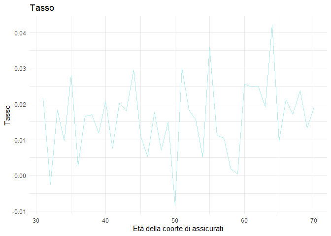
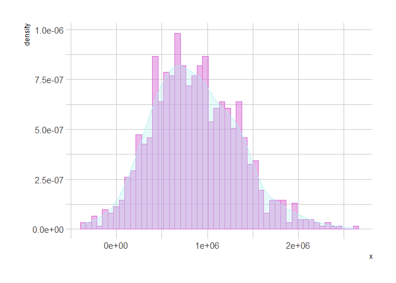

# Introduzione

Nel seguente report vengono approfonditi, come da richiesta, alcuni degli aspetti relativi al progetto 1. In seguito si riporta la consegna:

> Il report (di lunghezza 2000-3000 parole, esclusi grafici e tabelle) dovrà contenere:
>
> -   <div>
>
>     Una spiegazione delle formule utilizzate per calcolare il premio e per l'evoluzione del fondo;
>
>     </div>
>
> -   Il codice e una spiegazione della logica utilizzata nella sua preparazione;
>
> -   Alcuni esempi che illustrino la versatilità della funzione in 1);
>
> -   Con riferimento a un dato esempio (es. rendita differita immediata temporanea), utilizzare il metodo Monte Carlo per valutare la distribuzione del fondo all'ultima epoca disponibile (valore atteso, deviazione standard, altri momenti, quantili, probabilità di rovina (fondo negativo), etc.).

# La funzione


```r
library(tibble)

#' Gestione Portafoglio
#' Dato un portafoglio, di rischi omogenei tra loro, la funzione calcola rendimento e andamento del fondo e i decessi 
#'
#' @param numeroAssicurati 
#' @param eta età degli assicurati
#' @param rata importo della rata annuale
#' @param fondoInizio importo iniziale del fondo
#' @param numeroPremi numero di premi che gli assicurati pagheranno
#' @param omega età massima raggiungibile
#' @param differimento rendita differita o immediata
#' @param temporanea rendita vitalizia o temporanea
#' @param anniCopertura anni di coperrtura nel caso di rendita temporanea
#' @param rateGarantiteDurata numero di rate garantite
#' @param rendimentoFondoAnnuo tasso di rendimento del fondo 
#' @param tassoAleatorio tasso fisso o aleatorio
#' @param tavolaMortalita tavola di mortalità con cui calcolare il premio
#' @param tassoTecnico tasso usato per calcolare il premio
#' @param tavolaPeriodo tavola utilizzata per simulare i decessi all'interno del portafoglio
#'
#' @return
#' La funzione ritorna l'andamento e il rendimento del fondo, i decessi e il premio che ciascun assicurato dovrà pagare
#' 
#' @export
#'
#' @examples
#' 

gestionePortafoglio = function(#input
  numeroAssicurati = 1000,
  eta = 20,
  rata = 1000,
  fondoInizio = 100000,
  numeroPremi = 15,
  omega = 110,
  differimento = 25,
  temporanea = FALSE,
  # temporanea o  vita intera
  anniCopertura = 35,
  rateGarantiteDurata = 5,
  rendimentoFondoAnnuo = 0.02,
  # tasso finanziario
  tassoAleatorio = TRUE,
  tavolaMortalita = demoIta$RG48M,
  #tavola utilizzata per la base tecnica
  tassoTecnico = 0.02,
  #tasso utilizzato per la base tecnica
  tavolaPeriodo = demoIta$SIM02) {
  # tavola utilizzata per calcolare i morti nel portafoglio
  # vengono inizializzati gli output
  andamentoFondo = NULL
  rendimentoFondo = NULL
  decessi = NULL
  # Fissiamo gli anni di copertura nel caso di una vitalizia
  if (!temporanea)
  {
    anniCopertura = omega - eta
  }
  # vettore anni
  anni = (eta+1):(anniCopertura + eta)
  
  calcoloVettoreTasso = function()
  {
    #il tasso si distribuisce come una normale
    ifelse(tassoAleatorio, return(rnorm(
      anniCopertura, mean = rendimentoFondoAnnuo, sd = 0.01
    )), return(rep(rendimentoFondoAnnuo, anniCopertura)))
    # accettiamo la possibilità di deflazione nel caso del aleatorio
  }
  
  tassoFinanziario = calcoloVettoreTasso()
  
  # calcola quante persone muoiono nel fondo
  calcoloDecessi = function()
  {
    died = NULL
    for (i in eta:(anniCopertura + eta))
    {
      sopravissuti = numeroAssicurati - sum(died)
      #mu = probabilità di decesso nell'anno i condizionatamente che siano in vita all'anno i
      mu =  (tavolaPeriodo[i + 1] - ifelse(i > (omega - 2), 0, tavolaPeriodo[i +
                                                                               2])) / ifelse(i > (omega - 1), 1, tavolaPeriodo[i + 1])
      #genera i morti da una normale con media quelli che in linea teorica dovrebbero morire
      mortiCasuali = abs(rnorm(1, sopravissuti * mu, mu))
      #arrotonda agli interi il numero di morti e nel caso sia > dei sopravissuti, li uccide tutti
      died = round(c(
        died,
        ifelse(mortiCasuali > sopravissuti, sopravissuti, mortiCasuali)
      ),
      digits = 0) #le persone sono interi e quindi si arrotonda a degli interi
    }
    return(died)
  }
  
  # calcola gli hPx tramite l_(x+h) / l_x
  hPx = function(h, x)
  {
    # il +1 è per compensare che in R i vettori partono da 1 mentre l'età parte da zero
    # ifelse serve a evitare il problema dell'età limite di andare fuori dal vettore
    return(ifelse(h + x > omega - 1, 0, tavolaMortalita[h + x + 1]) / tavolaMortalita[x + 1])
  }
  
  # assicurati vivi
  hAV = function(h)
    # indica al tempo t il numero di assicurati sopravissuti
  {
    return(numeroAssicurati - ifelse(h > 0, sum(decessi[1:h]), 0))
  }
  
  
  # PREMIO
  premio = function()
  {
    if (rateGarantiteDurata > 0)
    {
      p = rata * (sum((1 + tassoTecnico) ** -c((differimento + 1):(differimento + 1 + rateGarantiteDurata)
      )) + sum((1 + tassoTecnico) ** -c((differimento + 1 + rateGarantiteDurata):anniCopertura
      ) * hPx(c((differimento + 1 + rateGarantiteDurata):anniCopertura
      ), eta)))
      if (numeroPremi == 1)
      {
        return(p)
      } else
      {
        return(p / sum((1 + tassoTecnico) ** -c(0:(
          numeroPremi - 1
        )) * hPx(c(
          0:(numeroPremi - 1)
        ), eta))) # parte da zero perché la prima la pagano tutti
      }
    } else
    {
      p = rata * sum((1 + tassoTecnico) ** -(c((
        differimento + 1
      ):anniCopertura)) * hPx(c((
        differimento + 1
      ):anniCopertura), eta))
      
      if (numeroPremi == 1)
      {
        return(p)
      } else
      {
        return(p / sum((1 + tassoTecnico) ** -c(0:(
          numeroPremi - 1
        )) * hPx(c(
          0:(numeroPremi - 1)
        ), eta))) # parte da zero perché la prima la pagano tutti
      }
      
    }
    return(-1) # nel caso l'utente inserisca rate garantite negative. Sì potrebbe mettere un try and catch
  }
  
  # INIZIO ANDAMENTO E RENDIMENTO
  
  # calcolo dei vari decessi
  decessi = calcoloDecessi()
  
  #Utilizzo della forumula ricorsiva
  # incasso dei premi e differimento
  if (differimento > 0) {
    for (t in 1:(differimento))
    {
      andamentoFondo = c(andamentoFondo,
                         (
                           ifelse(t > numeroPremi, 0, hAV(t) * premio()) +
                             ifelse(t > 1, andamentoFondo[t -
                                                            1], fondoInizio)
                         ) * (1 + tassoFinanziario[t]))
      rendimentoFondo = c(rendimentoFondo,
                          andamentoFondo[t] - ifelse(t > 1, andamentoFondo[t - 1], fondoInizio))
    }
  }
  
  # calcolo del fondo dall'inizio del pagamento delle rate
  for (t in (differimento + 1):(anniCopertura))
  {
    andamentoFondo = c(andamentoFondo, (
      ifelse(
        t > 1,
        andamentoFondo[t - 1],
        fondoInizio + premio() * numeroAssicurati
      ) -
        (
          rata * ifelse((t - differimento) > rateGarantiteDurata,
                        hAV(t + 1),
                        numeroAssicurati
          )
        )
    ) * (1 + tassoFinanziario[t]))
    rendimentoFondo = c(rendimentoFondo,
                        andamentoFondo[t] - ifelse(t > 1, andamentoFondo[t - 1], fondoInizio))
  }
  
  #Creazione dell'oggetto che la funzione dovrà tornare
  # print(c(length(anni),length(andamentoFondo),length(c(replicate(numeroPremi,premio()),
  #                            rep(0,anniCopertura-numeroPremi)))))
  Output = tibble(anni,
                  andamentoFondo,
                  rendimentoFondo,
                  decessi = decessi[2:length(decessi)],
                  premio = c(replicate(numeroPremi, premio()),
                             rep(0, differimento-numeroPremi),
                             rep(rata, anniCopertura-differimento)),
                  tasso = tassoFinanziario)
  
  return(Output)
  
}
```

## Funzione stampaGrafico


```r
library(ggplot2)
# library(hrbrthemes) # for ggplot's theme


stampaGrafici = function(dataFunzione)
{
  gg1 = ggplot(dataFunzione, aes(anni, andamentoFondo)) + 
    geom_line(color = "paleturquoise",
               fill = "paleturquoise",
               alpha = 1) + 
    geom_point(color = "orchid") +
    scale_y_continuous(labels = scales::unit_format(unit = "€")) +
    geom_hline(yintercept = 0, color = "red") + 
    theme_minimal() +
    annotate(geom = "text",x = max(dataFunzione$anni)*0.9,y = max(dataFunzione$andamentoFondo)*.8,
             label = paste("Premio: €",
                                    formatC(dataFunzione$premio[1],
                                            big.mark=',',
                                            digits = 2,
                                            format = 'f'))) +
    labs(title = "Andamento del fondo") + 
    ylab(label = "Andamento del fondo") + 
    xlab("Età della coorte di assicurati")
   
  gg2 = ggplot(dataFunzione, aes(anni, rendimentoFondo)) + 
    geom_line(color = "paleturquoise",
               fill = "paleturquoise",
               alpha = 1) + 
    geom_point(color = "orchid") +
    scale_y_continuous(labels = scales::unit_format(unit = "€")) +
    geom_hline(yintercept = 0, color = "red") + 
    theme_minimal() +
    labs(title = "Rendimento del fondo") + 
    ylab(label = "Rendimento del fondo") + 
    xlab("Età della coorte di assicurati")
  
  gg3 = ggplot(dataFunzione, aes(anni, decessi)) + 
    geom_area(color = "orchid",
               fill = "orchid",
               alpha = 0.5) + 
    theme_minimal() +
    labs(title = "Decessi") + 
    ylab(label = "Decessi") + 
    xlab("Età della coorte di assicurati")
  
  gg4 = ggplot(dataFunzione, aes(anni, tasso)) + 
    geom_line(color = "paleturquoise") + 
    theme_minimal() +
    labs(title = "Tasso") + 
    ylab(label = "Tasso") + 
    xlab("Età della coorte di assicurati")
  
  gg = list(gg1,gg2,gg3,gg4)
  
  return(gg)
}
```


# Report

Nella seguente si parte dalla spiegazione delle formule utilizzate per calcolare il premio e per l'evoluzione del fondo per poi proseguire una spiegazione del codice e della logica utilizzata nella sua preparazione.

Si è sviluppata la funzione `gestionePortafoglio` che simula l'andamento stocastico del fondo di un portafoglio di rendite relativo a una popolazione omogenea di assicurati. In input è possibile passare una serie di parametri che consentono di generare diversi tipi di rendite (tra cui la vitalizia), la base tecnica (tavola di mortalità e tasso tecnico), tavola di mortalità per simulare le morti e tasso finanziario per simulare la distribuzione dei rendimenti del fondo. Di default la funzione lavora con un portafoglio di 1.000 assicurati, di 20 anni ciascuno, che versano 15 premi periodici e costanti, al fine di ottenere una rendita vitalizia a vita intera anticipata, differita di 25 anni e di rata annua pari a 1.000 euro. Se non diversamente specificato, gli assicurati godono del beneficio delle rate garantite per la durata di 5 anni. Il fondo iniziale, allocato al portafoglio, è stato scelto di importo pari a 100.000 euro ed evolve con un tasso aleatorio con distribuzione normale (di media 0,02 e deviazione standard 0,01). Vengono infine passati in input: tasso utilizzato per il calcolo dei premi e 2 tavole di mortalità (una utilizzata per la base tecnica e una utilizzata per calcolare le morti effettive nel portafoglio). Le tavole appartengono al pacchetto `lifecontingencies` presente in R, che fornisce gli strumenti per eseguire la valutazione del rischio delle assicurazioni sulla vita.

La funzione restituisce in output i decessi che avvengono nel portafoglio anno per anno, l'andamento del fondo e il rendimento dello stesso.

Nella prima parte del corpo della funzione sono stati inseriti una serie di cicli e funzioni che permettono di lavorare con i dati passati in input, in modo da creare e predisporre in maniera ottimale tutti i dati e le variabili che serviranno poi per determinare gli output. Il primo ciclo `if` serve a fissare gli anni di copertura nel caso di una rendita vitalizia. Questi sono calcolati sottraendo a `omega`, l'età massima raggiungibile dagli assicurati, fissata a 110 anni l'età di sottoscrizione del contratto.

In seguito si è inserita una funzione che restituisce un vettore di lunghezza pari agli anni di copertura della rendita, contenente i tassi annui che determinano l'andamento del fondo inizialmente allocato. Se il tasso è aleatorio, vengono estratti i valori da una normale, di media pari al tasso passato in input alla funzione principale, e deviazione standard 0,01 (altrimenti viene restituito un vettore di valori tutti uguali e pari al tasso certo scelto). La funzione così costruita permette, nel caso del tasso aleatorio, di accettare la possibilità di deflazione.

Conseguentemente è stata richiamata la funzione `calcoloVettoreTasso`. La funzione `calcoloDecessi` restituisce i decessi nel portafoglio. All'interno del ciclo `for`, dopo aver inizializzato il vettore `died`, viene calcolato il numero di sopravvissuti all'i-esimo anno e viene determinata la probabilità di decesso nell'anno per un generico assicurato in vita all'anno i (`mu`). Si è utilizzata la formula studiata nel corso di "Matematica attuariale delle assicurazioni vita" e gli $l_x$ della tavola di mortalità, passata in input alla funzione principale. La probabilità, calcolata per ogni anno di copertura della rendita, viene poi utilizzata per estrarre un valore da una normale (di media $sopravvissuti*mu$),\* che corrisponde al numero di decessi che ci si aspetterebbe in linea teorica. Questo numero, rappresentante i decessi nell' i-esimo anno, viene preso in valore assoluto, arrotondato agli interi e concatenato al vettore `died`. Se infine il valore generato è superiore al numero dei sopravvissuti, il numero di decessi considerato per l'anno viene posto uguale al numero dei sopravvissuti. La funzione restituisce il vettore `died`, contenente il numero di decessi anno per anno (sono stati aggiunti dei cicli `ifelse` per evitare che venga superato il limite della tavola di mortalità).

La funzione `hPx` calcola le probabilità di un individuo di età $x$ di essere in vita all'età $x+h$ (viene utilizzata la formula studiata nel corso di "Matematica delle assicurazioni vita": $l_{x+h}/l_x$). Il ciclo `ifelse` serve a evitare il problema dell'età limite, di "sforare" dal vettore. Invece, per quanto riguarda la formula, il $+1$ è stato inserito al fine di compensare il fatto che (in *R*) i vettori partono da 1,mentre l'età parte da zero.

La funzione `hAV` restituisce il numero di assicurati sopravvissuti al tempo $h$ (passato come parametro). In particolare dopo aver controllato che il parametro passato in input sia coerente, ovvero positivo, sottrae al numero iniziale di assicurati iniziale i decessi avvenuti fino all'istante $h$ (se $h$ è negativo i decessi sono fissati a zero).

La funzione `premio` calcola, per i diversi casi, i premi che gli assicurati devono versare. Per prima cosa un ciclo `if` verifica se è presente o meno il beneficio delle rate garantite, in caso affermativo calcola con l'opportuna formula il valore del premio unico, che viene restituito se un secondo ciclo `if` verifica che il premio da versare è effettivamente unico, altrimenti, se i premi sono periodici, viene restituito il valore calcolato diviso il valore attuariale di una rendita vitalizia temporanea anticipata di durata pari al numero dei premi da versare. Per il calcolo si è posta l'ipotesi che, nel caso di premi periodici, questi fossero costanti. Se il beneficio delle rate garantite non è presente, il procedimento è il medesimo ma la formula per il calcolo del premio unico varia. Il premio sarà infatti di importo minore, in quanto tutte le rate dipendono dalla durata di vita dell'assicurato.

Dopo aver predisposto tutte queste funzioni, nella parte successiva del progetto si inizia il calcolo vero e proprio degli output richiesti. Per prima cosa si richiama la funzione `calcoloDecessi`, per ottenere il vettore con i decessi istante per istante.

Per il calcolo del rendimento e dell'andamento si è isolato il caso in cui la rendita è di tipo differito, in quanto in questo periodo si ha solamente incassi dei premi, senza il versamento di alcuna rata. Il ciclo `if` verifica se il differimento è maggiore di zero e, in caso affermativo, calcola per ogni $t$ (fino al tempo in cui si inizia a versare le rate) i due valori, concatenandoli in seguito ai valori precedentemente calcolati. L'andamento del fondo viene determinato capitalizzando mediante il tasso finanziario, di anno in anno, il valore del fondo in $t-1$. Questo risultato viene poi maggiorato tramite gli ingressi dei premi calcolato moltiplicando il valore restituito dalla funzione premio con il numero di assicurati ancora in vita, restituito dalla funzione `hAV`. Il ciclo `ifelse` permette di controllare se $t$ è maggiore del periodo di versamento premi, in caso affermativo non aumenta più il fondo con i premi.  Per il calcolo del rendimento invece, al valore del fondo in $t$, viene sottratto il valore del fondo in $t-1$ (se $t>1$).

Si incomincia poi a calcolare l'andamento e il rendimento del fondo dall'inizio del pagamento delle rate (nel caso in cui sia presente il differimento, i risultati ottenuti ora saranno concatenati ai precedenti in modo da ottenere due vettori, uno contenente anno per anno il valore del fondo e l'altro il rendimento annuo).

L'andamento del fondo viene così determinato, in questo caso capitalizzando il fondo in $t-1$ (se $t>1$), ridotto dalle rate versate. Queste vengono calcolate moltiplicando la rata per gli assicurati iniziali, se è presente il beneficio delle rate garantite e se queste non sono già state tutte corrisposte, altrimenti la rata è moltiplicata per il numero di assicurati in vita (dato fornito dalla funzione `hAV`). Se invece $t=1$ le rate versate vengono sottratte dal fondo iniziale (incrementato dai premi), pagati in quest'epoca da tutti, in quanto tutti sono in vita alla sottoscrizione del contratto.

Il rendimento del fondo è calcolato sempre sottraendo al valore del fondo in $t$ il valore del fondo in $t-1$ (se $t>1$).

Dal momento che una funzione può ritornare soltanto una variabile, e noi necessitiamo di ritornare diverse variabili/vettori, si è deciso di incapsulare le variabili in un oggetto (`output`), di modo che l'utente possa prelevare dall'oggetto l'attributo a cui è interessato. E' stato infine creato l'oggetto `output` che la funzione dovrà restituire e gli sono stati assegnati gli opportuni valori.

## Esempi


```r
o = gestionePortafoglio(
  numeroAssicurati = 10000,
  eta = 30,
  rata = 20000,
  fondoInizio = 0,
  numeroPremi = 25,
  differimento = 30,
  temporanea = FALSE,
  anniCopertura = 50,
  rateGarantiteDurata = 10,
  rendimentoFondoAnnuo = 0.02,
  tassoTecnico = 0.02,
  tassoAleatorio = TRUE,
  tavolaMortalita = demoIta$SIM92,
  tavolaPeriodo = demoIta$SIM92
)

stampaGrafici(o)[[1]]
```

<!-- -->

```r
stampaGrafici(o)[[2]]
```

<!-- -->

```r
stampaGrafici(o)[[3]]
```

<!-- -->

```r
stampaGrafici(o)[[4]]
```

<!-- -->


```r
o = gestionePortafoglio(
  numeroAssicurati = 1000,
  eta = 30,
  rata = 12000,
  fondoInizio = 10000,
  numeroPremi = 30,
  differimento = 30,
  temporanea = TRUE,
  anniCopertura = 40,
  rendimentoFondoAnnuo = 0.018,
  tassoTecnico = 0.02,
  tassoAleatorio = TRUE
)
# print(o$premio)
# plot(y = o$andamentoFondo,x = c(31:70),type="l")
# abline(h=0)
# plot(y = o$rendimentoFondo,x = c(31:70),type="l")
# abline(h=0)
stampaGrafici(o)[[1]]
```

<!-- -->

```r
stampaGrafici(o)[[2]]
```

<!-- -->

```r
stampaGrafici(o)[[3]]
```

<!-- -->

```r
stampaGrafici(o)[[4]]
```

<!-- -->

# Metodo Monte Carlo


```r
#' MonteCarlo
#'
#' @param x 
#' @param level 
#' @param numeroMomenti 
#'
#' @return 
#' @export
#'
#' @examples
MonteCarlo <- function(x,
                       level = 0.95,
                       numeroMomenti = 10)
{
  monteCarlo = new.env()
  nSimulazioni = length(x)
  monteCarlo$valAtteso = mean(x)
  monteCarlo$varianzaCampionaria = sd(x) / sqrt(nSimulazioni - 1)
  #lower tail = false indica che la prob diverta 1-alpha al posto di alpha
  z = qnorm((1 - level) / 2, lower.tail = FALSE)
  intConfLow = monteCarlo$valAtteso - z * monteCarlo$varianzaCampionaria
  intConfUp = monteCarlo$valAtteso + z * monteCarlo$varianzaCampionaria
  monteCarlo$intervalloConfidenza = c(intConfLow, intConfUp)
  for (i in 1:numeroMomenti)
  {
    monteCarlo$momenti[i] = mean(x ** i)
  }
  
  #probabilità di rovina
  rovine=0
  for (i in 1:length(x))
  {
    rovine = rovine+ifelse(x[i] < 0, 1, 0)
  }
  monteCarlo$rovina = rovine / length(x)
  
  monteCarloTibble = tibble(ValoreAtteso = monteCarlo$valAtteso,
                            VarianzaCampionaria = monteCarlo$varianzaCampionaria,
                            intervalloConfidenzaInferiore = intConfLow,
                            intervalloConfidenzaSuperiore = intConfUp,
                            ProbabilitàDiRovina = monteCarlo$rovine)
  
  monteCarlo$Tabella = monteCarloTibble
  
  return(monteCarlo)
}
```

Per la simulazione si è definita una funzione `monteCarlo` con lo scopo, a partire da una simulazione arbitrariamente grande ($10^5$ per motivi di computazione) della variabile osservata, di stabilire, grazie alla legge dei grandi numeri, il vero valore teorico della distribuzione simulata.


```r
library(hrbrthemes) # for ggplot's theme
```

```
## NOTE: Either Arial Narrow or Roboto Condensed fonts are required to use these themes.
```

```
##       Please use hrbrthemes::import_roboto_condensed() to install Roboto Condensed and
```

```
##       if Arial Narrow is not on your system, please see https://bit.ly/arialnarrow
```

```r
x = replicate(10 ** 3,
              gestionePortafoglio(fondoInizio = 1000,
                                  numeroAssicurati = 100,
                                  tassoAleatorio = 0.01,
                                  tassoTecnico = 0.02
                                  )$andamentoFondo[90])

MonteCarlo(x)$Tabella
```

<div data-pagedtable="false">
  <script data-pagedtable-source type="application/json">
{"columns":[{"label":["ValoreAtteso"],"name":[1],"type":["dbl"],"align":["right"]},{"label":["VarianzaCampionaria"],"name":[2],"type":["dbl"],"align":["right"]},{"label":["intervalloConfidenzaInferiore"],"name":[3],"type":["dbl"],"align":["right"]},{"label":["intervalloConfidenzaSuperiore"],"name":[4],"type":["dbl"],"align":["right"]}],"data":[{"1":"865035.8","2":"15129.7","3":"835382.1","4":"894689.4"}],"options":{"columns":{"min":{},"max":[10]},"rows":{"min":[10],"max":[10]},"pages":{}}}
  </script>
</div>

```r
x %>% 
  tibble %>% 
  ggplot(aes(x, y = ..density..)) +
  geom_histogram(color = "orchid",
               fill = "orchid",
               alpha = 0.5,
               bins = 50) +
  geom_density(color = "paleturquoise",
               fill = "paleturquoise",
               alpha = 0.3, # densità del colore 
               kernel = "gaussian",
               adjust = 1) +
  theme_ipsum()
```

<!-- -->

# Funzione aggiuntiva: Capitale minimo 

Per sfruttare al meglio `MonteCarlo` e `gestionePortafoglio` è stata sviluppata la funzione `CapitaleMinimo`, il suo obiettivo è quello di definire il capitale iniziale da allocare al portafoglio in modo tale che la probabilità di rovina (all'ultimo anno della rendita) sia al di sotto di quella prefissata (in questa caso consideriamo il 5%). Il problema lo si potrebbe estendere anche agli anni precedenti all'ultimo della rendita, in modo che la probabilità di rovina sia sempre sotto la soglia; per fare ciò basterebbe inserire la funzione CapitaleMinimo all'interno di un ciclo `for` con l'indice che va da 1 agli anni della rendita. Inoltre, l'idea della funzione è che dati i parametri a meno di uno, la funzione calcola il *p-value* per la variabile incognita. Quindi, la funzione con piccole modifiche può essere estesa anche agli altri parametri della funzione `gestionePortafoglio`. Per cercare il capitale minimo si utilizza un processo ricorsivo in cui iniziando da $0$ (il capitale minimo), lo si aumenta e si verifica se rispetta la condizione della probabilità di rovina, il capitale viene aumentato secondo una formula in modo tale da snellire e abbreviare la procedura, ottenendo così un risultato meno preciso.


```r
#' Capitale Minimo
#'
#' @param numeroAssicurati 
#' @param eta 
#' @param rata 
#' @param numeroPremi 
#' @param omega 
#' @param differimento 
#' @param temporanea 
#' @param anniCopertura 
#' @param rateGarantiteDurata 
#' @param rendimentoFondoAnnuo 
#' @param tassoAleatorio 
#' @param tavolaMortalita 
#' @param tassoTecnico 
#' @param tavolaPeriodo 
#' @param andamentoFondo 
#' @param rendimentoFondo 
#' @param decessi 
#' @param precisione 
#'
#' @return
#' @export
#'
#' @examples
capitaleMinimo = function (numeroAssicurati = 1000,
                           eta = 20,
                           rata = 1000,
                           numeroPremi = 15,
                           omega = 110,
                           differimento = 25,
                           temporanea = FALSE,
                           # temporanea o  vita intera
                           anniCopertura = 35,
                           rateGarantiteDurata = 5,
                           rendimentoFondoAnnuo = 0.01,
                           # tasso finanziario
                           tassoAleatorio = TRUE,
                           tavolaMortalita = demoIta$RG48M,
                           #tavola utilizzata per la base tecnica
                           tassoTecnico = 0.02,
                           #tasso utilizzato per la base tecnica
                           tavolaPeriodo = demoIta$SIM02,
                           precisione = 1000, anno = 90)
{
  capitaleMinimo = 0
  x = 0
  for (i in 1:precisione)
  {
    x[i] =
      gestionePortafoglio(
        numeroAssicurati = numeroAssicurati,
        eta = eta,
        rata = rata,
        numeroPremi = numeroPremi,
        omega = omega,
        differimento = differimento,
        temporanea = temporanea,
        anniCopertura = anniCopertura,
        rateGarantiteDurata = rateGarantiteDurata,
        rendimentoFondoAnnuo = rendimentoFondoAnnuo,
        tassoAleatorio = tassoAleatorio,
        tavolaMortalita = tavolaMortalita,
        tassoTecnico = tassoTecnico,
        tavolaPeriodo = tavolaPeriodo,
        fondoInizio = capitaleMinimo
      )$andamentoFondo[anno]
  }
  while (MonteCarlo(x)$rovina > 0.05)
  {
    capitaleMinimo = capitaleMinimo + abs(quantile(x, probs = 0.05)) / ifelse(MonteCarlo(x)$rovina > 0.9,
                                                      8,
                                                      ifelse(
                                                        MonteCarlo(x)$rovina > 0.1,
                                                        20,
                                                        ifelse(MonteCarlo(x)$rovina > 0.08, 30, 40)
                                                      ))
    # print(capitaleMinimo)
    probabilitaRovina = MonteCarlo(x)$rovina
    # print(probabilitaRovina)
    for (i in 1:precisione)
    {
      x[i] = gestionePortafoglio(
        numeroAssicurati = numeroAssicurati,
        eta = eta,
        rata = rata,
        numeroPremi = numeroPremi,
        omega = omega,
        differimento = differimento,
        temporanea = temporanea,
        anniCopertura = anniCopertura,
        rateGarantiteDurata = rateGarantiteDurata,
        rendimentoFondoAnnuo = rendimentoFondoAnnuo,
        tassoAleatorio = tassoAleatorio,
        tavolaMortalita = tavolaMortalita,
        tassoTecnico = tassoTecnico,
        tavolaPeriodo = tavolaPeriodo,
        fondoInizio = capitaleMinimo
      )$andamentoFondo[anno]
    }
  }
  return(capitaleMinimo)
}

capMin = capitaleMinimo(rendimentoFondoAnnuo = 0.015,tassoTecnico = 0.02,precisione = 100)
capMin
```

```
##      5% 
## 2070065
```
